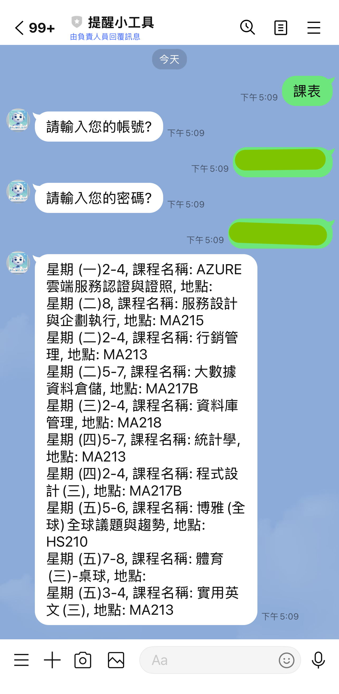

# Line Bot 提醒小工具

## 目錄
1. [簡介](#簡介)
2. [功能特色](#功能特色)
3. [使用說明](#使用說明)
   - [新增提醒](#新增提醒)
   - [刪除提醒](#刪除提醒)
   - [查詢提醒](#查詢提醒)
   - [課表查詢](#課表查詢)
   - [加入群組](#加入群組)

4. [操作畫面](#操作畫面)
   - [加入好友（個人）](#加入好友（個人）)
   - [加入好友（群組）](#加入好友（群組）)
   - [選單畫面](#選單畫面)
   - [新增提醒](#新增提醒)
   - [刪除提醒](#刪除提醒)
   - [未完成的提醒](#未完成的提醒)
   - [課表查詢](#課表查詢)
   - [群組](#群組)

5. [系統設計與架構](#系統設計與架構)
   - [開發工具](#開發工具)
   - [系統設計](#系統設計)

6. [技術支援](#技術支援)

## 簡介
本 LINE Bot 旨在為學生提供一個智能化課表與任務管理工具，支援課程提醒、群組專案協作功能，幫助用戶高效管理時間和任務。

## 功能特色
- 支持新增、查詢、刪除提醒。
- 支援群組專案提醒功能，方便團隊協作。
- 自動爬取課表資訊，確認每日課程。
- 定時通知未完成事項，避免遺漏。

## 使用說明
##### 新增提醒
1. 使用者在聊天室輸入 `新增提醒`。
2. 機器人將回覆新增提醒的格式，如：
`須完成日期：
預計完成內容：
註：
誰的工作：`
3. 按照格式輸入提醒內容，完成後系統會回覆確認訊息。

##### 刪除提醒
1. 使用者在聊天室輸入 `刪除提醒`。
2. 系統將列出當前的所有提醒事項，使用者選擇欲刪除的項目即可。

##### 查詢提醒
- 查詢未完成事項：輸入 `未完成`，系統將回傳所有未完成的提醒事項。
- 查詢已完成事項：輸入 `已完成`，系統將回傳所有已完成的提醒事項。

##### 課表查詢
- 輸入 `學號` 及 `密碼` 後，系統將自動爬取課表並回傳當前學期的課程安排。

##### 加入群組
- 使用者加入群組後，系統會自動傳送歡迎訊息及簡易操作說明。

## 操作畫面
##### 加入好友（個人）

##### 加入好友（群組）

##### 選單畫面

##### 新增提醒

##### 刪除提醒

##### 未完成的提醒

##### 課表查詢

##### 群組

## 系統設計與架構
##### 開發工具
- 程式語言： Python
- 框架及套件： Flask、requests、bs4、linebot...
- 資料庫： Google sheet
- 編輯器： Visual Studio Code
- Line Bot API： 使用Line官方提供的API開發和管理LineBot功能

##### 系統設計

 

## 技術支援
若有任何問題，請聯繫開發團隊：
- 指導教授：謝文川
- 專題學生：陳韋均、高宇希、張庭溱、陳筠樺、許庭瑄

---

本教學手冊適用於 113 學年度專題開發的 LINE 課表提醒機器人，感謝您的使用！
